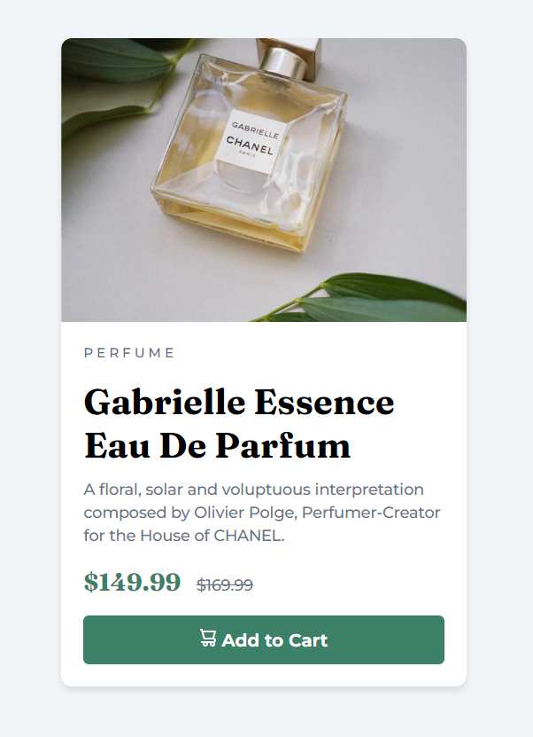

# 📦 Product Preview Card Component(^///^)

This is a custom-built product preview card component. It is designed to be fully responsive and optimized for different screen sizes. 👾🖥️📱

## 📑 Table of Contents
- [Overview](#overview)
  - [Features](#features)
  - [Screenshot](#screenshot)
  - [Live Demo](#live-demo)
- [🔧 Tech Stack](#-tech-stack)
- [🚀 Installation](#-installation)
- [📖 What I Learned](#-what-i-learned)
- [🔗 Useful Resources](#-useful-resources)
- [👨‍💻 Author](#-author)
- [🙏 Acknowledgments](#-acknowledgments)

## 📌 Overview

### 🎯 Features
✅ Fully responsive design (Desktop & Mobile)<br>
✅ Optimized for accessibility<br>
✅ Clean and modern UI<br>
✅ Interactive hover and focus states<br>

### 🖼 Screenshot



### 🌍 Live Demo
[Check it out here!](https://alan61503.github.io/product-display/)


## 🔧 Tech Stack
- Semantic **HTML5**
- **CSS3** (Flexbox, Grid, Custom Properties)
- Mobile-first design approach 📱

## 🚀 Installation
1. Clone the repository:
   ```sh
   git clone https://github.com/alan61503/product-card-component.git
   ```
2. Open the `index.html` file in your browser.

## 📖 What I Learned
Working on this project helped me improve:
- Responsive design techniques 📱
- CSS Flexbox & Grid 🎨
- Font pairing and typography 🎭
- Mobile-first development approach ✅

## 🔗 Useful Resources
- [CSS Tricks - Flexbox Guide](https://css-tricks.com/snippets/css/a-guide-to-flexbox/) 🔥
- [MDN Web Docs](https://developer.mozilla.org/) 📚
- [Google Fonts](https://fonts.google.com/) 🎨

## 👨‍💻 Author
- GitHub - [alan61503](https://github.com/alan61503) 🏗️
- LinkedIn - [Alan Chris Dsilva](https://www.linkedin.com/in/alan-chris-disilva/) 🔗

## 🙏 Acknowledgments
A huge thanks to all the amazing developers sharing their knowledge online! 🎉
